# Node.js Authentication System

This project contains a complete authentication system using Node.js, Express, Passport.js, and MongoDB.
Nó hỗ trợ đầy đủ các tính năng: đăng ký, đăng nhập, đăng xuất, đổi mật khẩu, quên mật khẩu, và đăng nhập bằng Google.

---

## Live Site

Chạy thử trực tiếp: `http://localhost:3000/user/signin`

---

## Features Implemented

* **Sign-up với Email**: Tạo tài khoản với email và mật khẩu.
* **Sign-in**: Đăng nhập tài khoản.
* **Sign-out**: Đăng xuất tài khoản.
* **Reset Password**: Đổi mật khẩu sau khi đăng nhập.
* **Forgot Password**: Lấy lại mật khẩu qua email.
* **Google Authentication**: Đăng nhập / đăng ký bằng Google.
* **Encrypted Passwords**: Lưu mật khẩu dưới dạng mã hóa.
* **Password Strength Validation**: Kiểm tra và báo lỗi nếu mật khẩu sai.
* **reCAPTCHA**: Chống bot khi đăng ký và đăng nhập.

---

## Environment Variables

Tạo file `.env` ở thư mục gốc, ví dụ:

```plaintext
PORT=3000
DB_URL=mongodb://localhost:27017/authdatabase

# Google OAuth
GOOGLE_CLIENT_ID=your_google_client_id
GOOGLE_CLIENT_SECRET=your_google_client_secret
GOOGLE_CALLBACK_URL=http://localhost:3000/auth/google/callback

# Gmail
EMAIL=your_email@gmail.com
PASSWORD=your_app_password

# reCAPTCHA
RECAPTCHA_SECRET_KEY=your_recaptcha_secret_key
RECAPTCHA_SITE_KEY=your_recaptcha_site_key

# Redirect URL
CLIENT_URL=http://localhost:3000/auth/login/success

# Secrets
SESSION_SECRET=your_session_secret
JWT_SECRET=your_jwt_secret
```

⚠️ Lưu ý: **Không commit file `.env` lên GitHub** vì chứa thông tin bí mật.

---

## Folder Structure

```csharp
NodeJS-Authentication-System/
├── config/                  # Cấu hình MongoDB, Passport
├── controllers/             # Business logic
├── models/                  # Database models (User, Token)
├── routes/                  # Routes (auth, user, password)
├── views/                   # Views EJS
├── public/                  # Static assets
│   └── results/             # Ảnh minh họa
├── app.js                   # Express app
├── package.json             # Config npm
├── .env                     # Environment variables
└── README.md
```

---

## Installation and Setup

1. Clone repo:

   ```bash
   git clone https://github.com/your-username/NodeJS-Authentication-System.git
   cd NodeJS-Authentication-System
   ```

2. Cài đặt dependencies:

   ```bash
   npm install
   ```

3. Chạy server:

   ```bash
   npm start
   ```

4. Truy cập:

   ```
   http://localhost:3000
   ```

---

## Dependencies Required

* express
* mongoose
* passport
* bcryptjs
* express-session
* ejs
* dotenv
* nodemailer
* google-auth-library
* recaptcha

---

## Hình minh họa

### Homepage

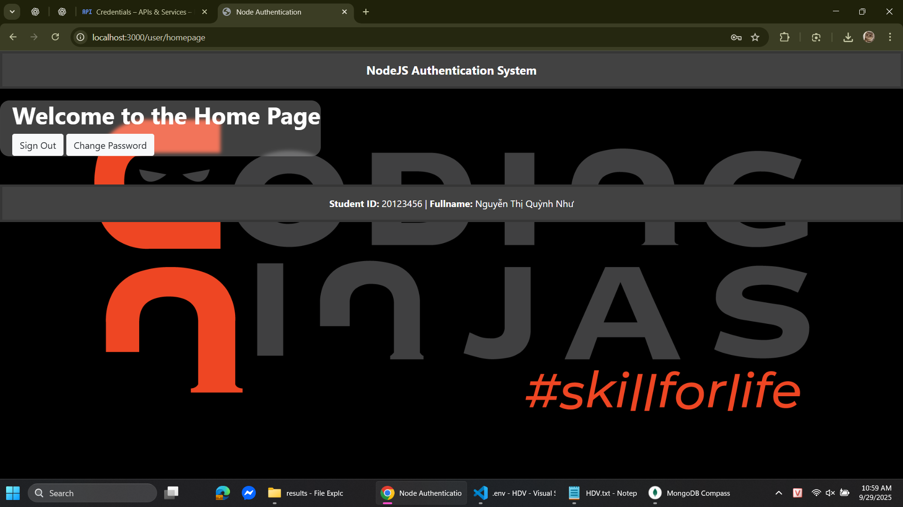

---

### Sign Up

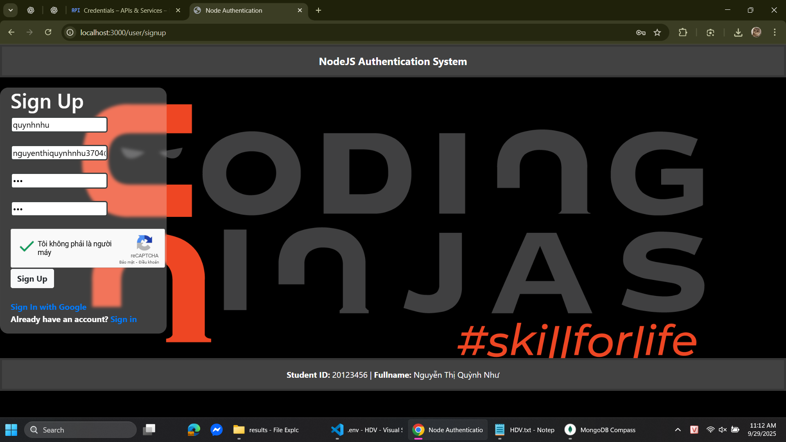
*Form đăng ký*

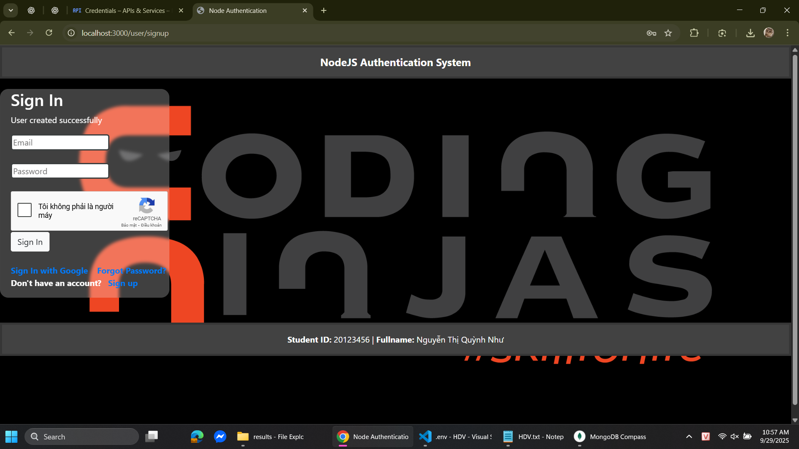
*Đăng ký thành công*

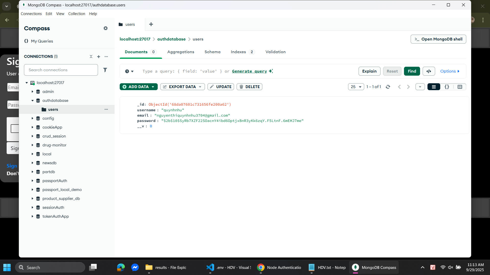
*User được lưu trong MongoDB*

---

### Sign In

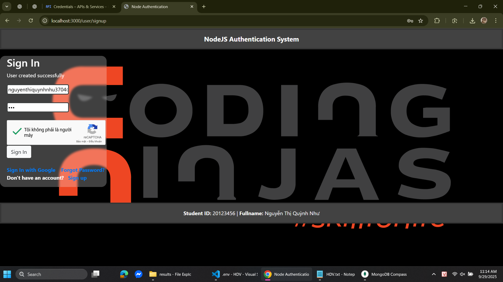
*Form đăng nhập*


*Đăng xuất thành công*

---

### Google Sign In

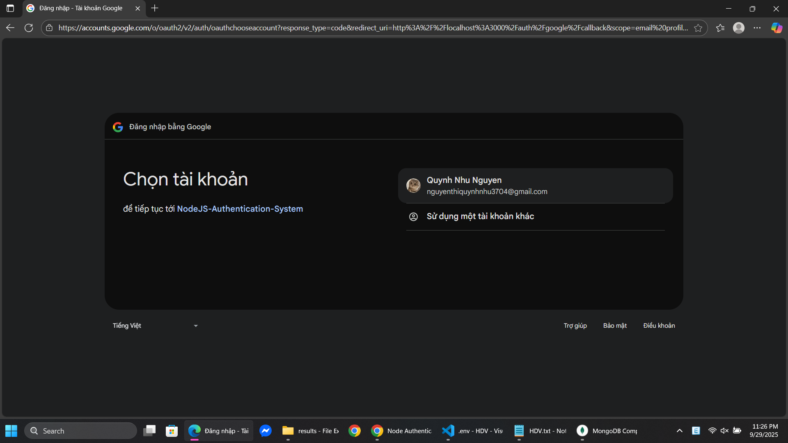
*Form đăng nhập với Google*

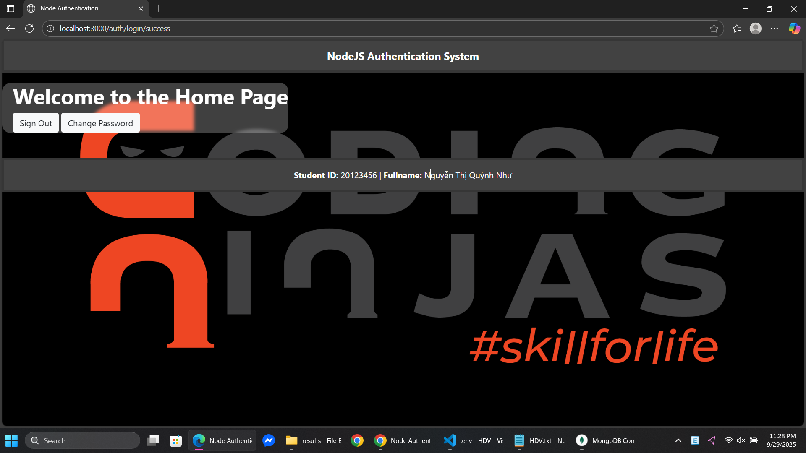
*Đăng nhập Google thành công*

---

### Change Password

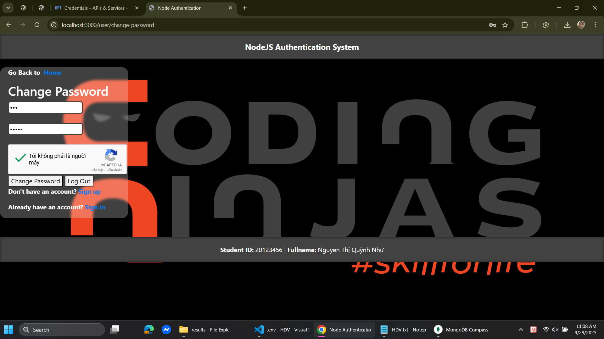
*Form đổi mật khẩu*

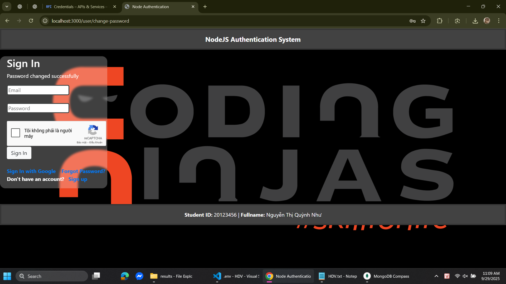
*Đổi mật khẩu thành công*


*Mật khẩu đã được cập nhật trong MongoDB*

---

### Forgot Password

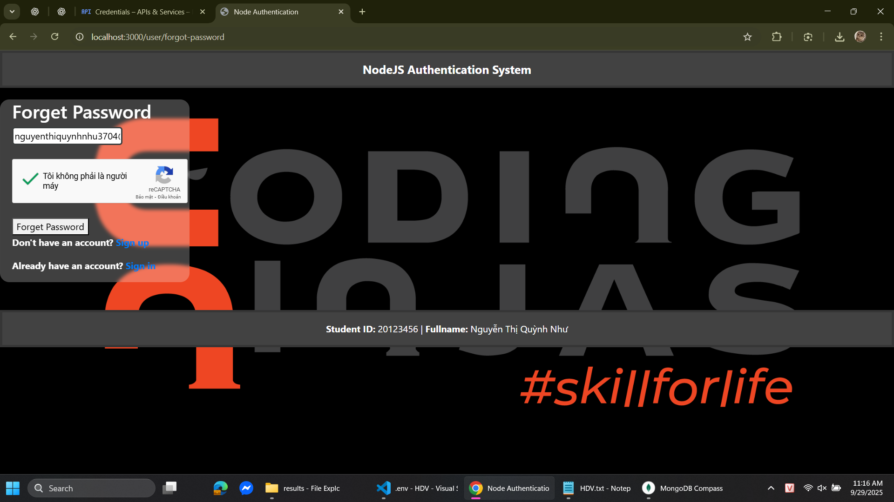
*Form quên mật khẩu*

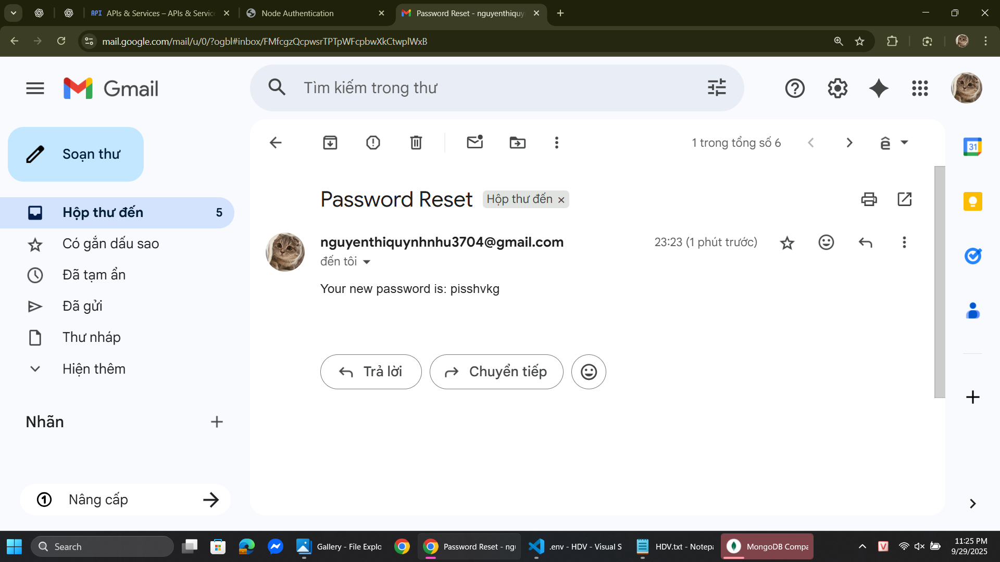
*Gửi link reset qua Gmail*

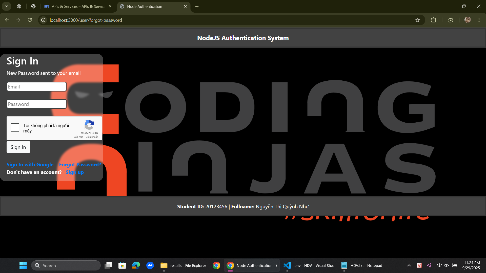
*Reset mật khẩu thành công*

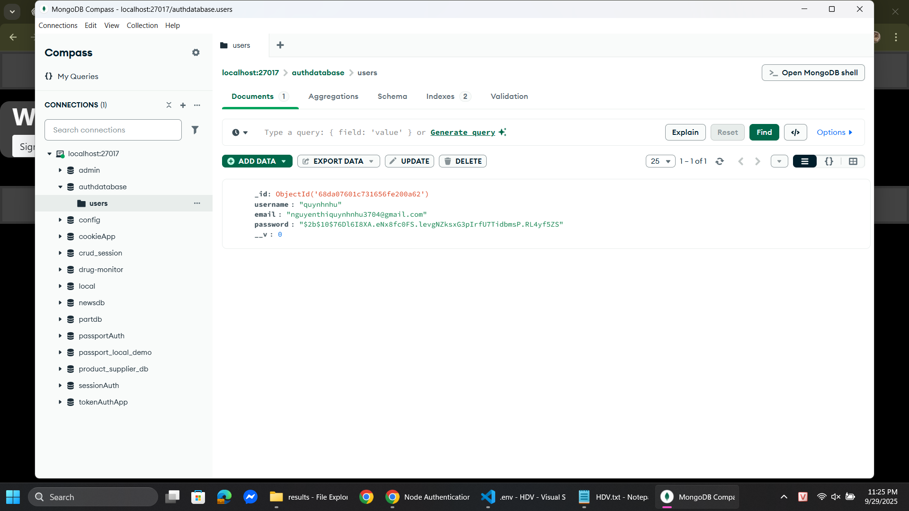
*MongoDB cập nhật mật khẩu mới*
